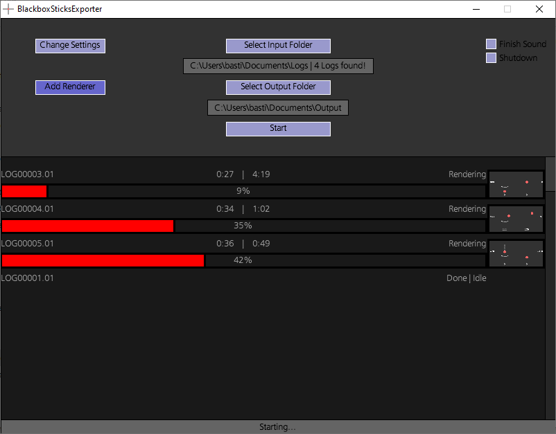

# BlackboxSticksExporter
Description:
BlackboxSticksExporter is used to export Sticks from multiple Blackbox Logs at the same time (Multithreaded batch export). The videos are in the .mov file format and feature transparency.

Usage:
1. run the BlackboxSticksExporter.exe and close it to create the directories
2. move all .BFL files in the /LOG directory
3. open the settings.xml file with any editor and check the settings
4. run the BlackboxSticksExporter.exe and wait until all the files are done.
5. the exported videos are now located in the /OUTPUT directory.

Features:
- variable Framerate / Resolution / Tail length / Border (Shadow) / Background
- Batch export
- .mov with alpha

Settings:
- "borderThickness": 0...100 (increases render time a lot)
- "backgroundColor": Color in Hex: #000000...#FFFFFF
- "backgroundOpacity": Opacity: 0...255 (0: 100% transparent, 255: 0% transparent)
- "stickColor": Color in Hex: #000000...#FFFFFF (betaflight default: #FF6666)
- "sticksModeVertPos": Vertical position of the mode in percent 0...100 (0: top, 100: bottom)

